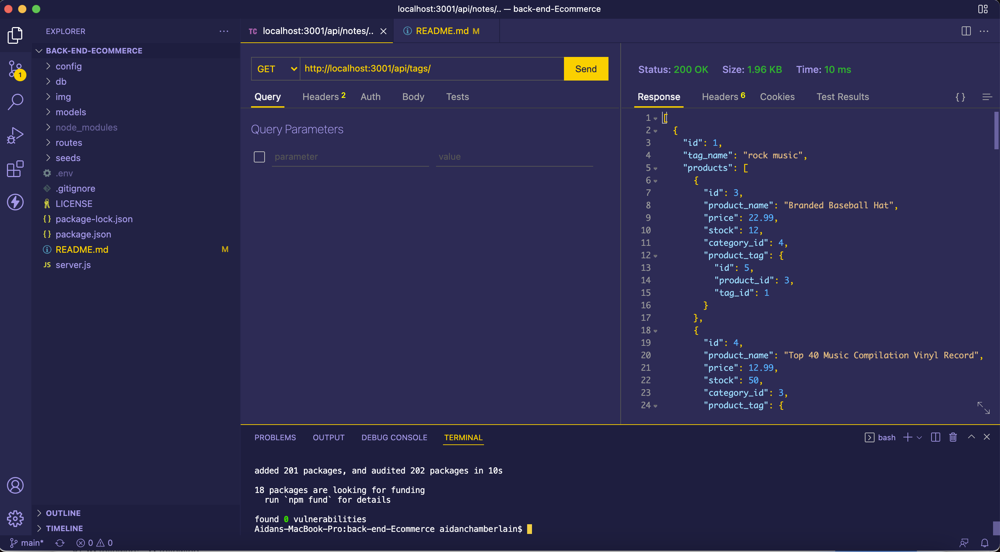

# back-end-Ecommerce 

## Table of Contents:

-   [Description](./README.md#description)
-   [Installation](./README.md#installation)
-   [Usage](./README.md#usage)
-   [License](./README.md#license)
-   [Contributing](./README.md#contributing)
-   [Screenshot](./README.md#screenshot)
-   [Links to Application](./README.md#links-to-application)
-   [Questions](./README.md#questions)

## Description

This is an express.js API for handling the backend of an ecommerce site. When a user adds the database name, MySQL username, and MySQL password to a .env file, then that user is allowed to connect to the database throgh sequelize.js. A user then utilizes the schema to create the database in MySQL, and runs "npm run seed" from the command line terminal to seed the database with the prepared information. When the user runs "node server.js" or "npm run start" from the command line terminal, the server is connected and the sequelize models are synced to the database. When the user opens a GET route in Insomnia (or similar client), the data for each GET route is displayed in JSON. Utilizing the POST, PUT, and DELETE routes for each database table allows the user to add, update, and delete information from the associated table in the database.

## Installation

If you wish to use this application, you will need to access my GitHub account (RedComet6) and copy/fork the code.

## Usage

To use this application, obtain the code from my GitHub account (RedComet6), and run "node server.js" or "npm run start" from the command line terminal.

## License

This software is licensed to MIT, for more information you may visit this link:
[MIT License Wikipedia](https://en.wikipedia.org/wiki/MIT_License)

## Contributing

If you wish to contribute to my content, please contact me at asunshine99@gmail.com.

## Screenshot

## Links to Application

-   Here is the demo recording: [https://drive.google.com/file/d/1xh6pfz7Ra1NyIcB259eL292xy7u0GJ5D/view?usp=sharing](https://drive.google.com/file/d/1xh6pfz7Ra1NyIcB259eL292xy7u0GJ5D/view?usp=sharing)
-   Here is the repo: [https://github.com/RedComet6/back-end-Ecommerce](https://github.com/RedComet6/back-end-Ecommerce)
-   Here is the pages: [https://redcomet6.github.io/back-end-Ecommerce/](https://redcomet6.github.io/back-end-Ecommerce/)

## Questions

If you have any questions, you may contact:

#### Aidan Chamberlain

Email: asunshine99@gmail.com  
Github Profile: [https://www.github.com/RedComet6](https://www.github.com/RedComet6)
